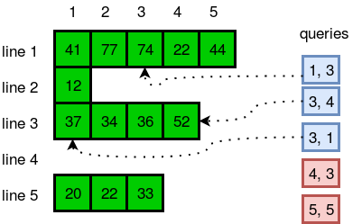

| [Previous Question](https://github.com/Kevin-Lago/java-hackerrank-solutions/tree/main/src/)</img> | [Home](https://github.com/Kevin-Lago/java-hackerrank-solutions)</img> | [Next Question](https://github.com/Kevin-Lago/java-hackerrank-solutions/tree/main/src/)</img> |
|:---|:---:|---:|

# Java ArrayList

Sometimes it's better to use dynamic size arrays. Java's [ArrayList](https://docs.oracle.com/javase/7/docs/api/java/util/ArrayList.html) can provide you this feature. Try to solve this problem using ArrayList.

You are given ___n___ lines. In each line there are zero or more integers. You need to answer a few queries where you need to tell the number located in the ___y<sup>th</sup>___ position of the ___x<sup>th</sup>___ line.

Take your input from System.in.

__Input Format__

The first line has an integer ___n___. In each of the next ___n___ lines there will be an integer ___d___ denoting numbers of integers on that line and then there will be ___d___ space-separated integers. In the next line there will be an integer ___q___ denoting number of queries. Each query will consist of two integers ___x___ and ___y___.

__Constraints__

- __1 <= _n_ <= 20000__

- __0 <= _d_ <= 50000__

- __1 <= _q_ <= 1000__

- __1 <= _x_ <= _n___

Each number will fit in signed integer.

Total number of integers in ___n___ lines will not cross __10<sup>5</sup>__.

__Output Format__

In each line, output the number located in the ___y<sup>th</sup>___ position of ___x<sup>th</sup>___ line. If there is no such position, just print "ERROR!".

__Sample Input__

```
5
5 41 77 74 22 44
1 12
4 37 34 36 52
0
3 20 22 33
5
1 3
3 4
3 1
4 3
5 5
```

__Sample Output__

```
74
52
37
ERROR!
ERROR!
```

__Explanation__

The diagram below explains the queries:



---

<details><summary>Solution</summary>
    
```java

```
</details>