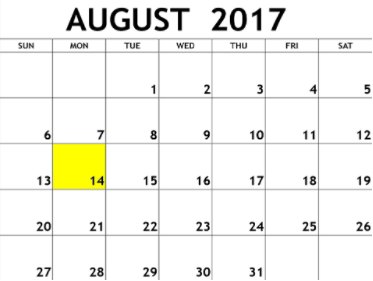

| [Previous Questions](https://github.com/Kevin-Lago/java-hackerrank-solutions/introduction/java_int_to_string)</img> | [Home](https://github.com/Kevin-Lago/java-hackerrank-solutions)</img> | [Next Question](https://github.com/Kevin-Lago/java-hackerrank-solutions/tree/main/src/introduction/java_currency_formatter)</img> |
|:---|:---:|---:|

# Java Date and Time

The [Calendar Class](https://docs.oracle.com/javase/7/docs/api/java/util/Calendar.html) is an abstract class that provides methods for converting between a specific instant in time and a set of calendar fields such as YEAR, MONTH, DAT_OF_MONTH, HOUR, and so on, and for manipulating the calendar fields, such as getting the date of the next week.

---

You are given a date. You just need to write the method, ___getDay___, which returns the day on that date. To simplify your task, we have provided a portion of the code in the editor.

__Example__

___month_ = 8__

___day_ = 14__

___year_ = 2017__

The method should reutnr ___MONDAY___ as the day on that date.



__Function Description__

Complete the findDay function in the editor below.

findDay has the following parameters:

- int: month

- int: day

- int: year

__Returns__

- string: the day of the week in capital letters.

__Input Format__

A single line of input containing the space separated month, day and year, respectively in __MM DD YYYY__ format.

__Constraints__

- __200 < _year_ < 3000__

__Sample Input__

```
08 05 2015
```

__Sample Output__

```
WEDNESDAY
```

__Explanation__

The day on August __5<sup>th</sup> 2015__ was a ```WEDNESDAY```

---

<details><summary>Solution</summary>
    
```java
import java.text.ParseException;
import java.text.SimpleDateFormat;
import java.util.Date;
import java.util.HashMap;
import java.util.Map;

public class Result {

    public static String findDay(int month, int day, int year) {
        Date date = new Date();
        SimpleDateFormat originalFormat = new SimpleDateFormat("MMddyyyy");
        String string = String.valueOf(month).length() > 1 ? String.valueOf(month) : "0" + String.valueOf(month);
        string += String.valueOf(day).length() > 1 ? String.valueOf(day) : "0" + String.valueOf(day);
        string += String.valueOf(year);

        try {
            date = originalFormat.parse(
                    string
            );
        } catch (ParseException e) {
            System.out.println("PANIC");
        }

        Map<Integer, String> days = new HashMap<>();
        days.put(0, "SUNDAY");
        days.put(1, "MONDAY");
        days.put(2, "TEUSDAY");
        days.put(3, "WEDNESDAY");
        days.put(4, "THURSDAY");
        days.put(5, "FRIDAY");
        days.put(6, "SATURDAY");

        return days.get(date.getDay());
    }

}
```
</details>
