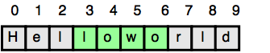

Given a string, ___s___ and two indicies, ___start___ and ___end___, print a [substring](https://en.wikipedia.org/wiki/Substring) consisting of all characters in the inclusive range from ___start__ to ___end_ - 1__. You'll find the String class' [substring method](https://docs.oracle.com/javase/8/docs/api/java/lang/String.html#substring-int-int-) helpful in completing this challenge.

__Input Format__

The first line contains a single string denoting ___s___.

The second line contains two space-separated integers denoting the respective values of ____start___ and ___end___.

__Constaints__

- __1 <= |_s_| <= 100

- __0 <= _start_ < _end_ <= _n___

- String ___s___ consists of English alphabetic letters (i.e, [___a - zA - Z___]) only.

__Output Format__

Print the substring in the inclusive range from ___start___ to ___end - 1___.

__Sample Input__

```
Helloworld
3 7
```

__Sample Output__

```
lowo
```

__Explanation__

In the diagram below, the substring is highlighted green:




__Solution__

```java
public static void main(String[] args) {
    Scanner scan = new Scanner(System.in);
    String s = scan.next();
    int start = scan.nextInt();
    int end = scan.nextInt();

    System.out.println(s.substring(start, end));
}
```
