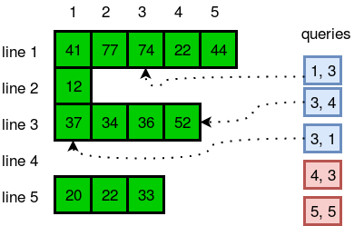

| [Previous Question](https://github.com/Kevin-Lago/java-hackerrank-solutions/tree/main/src/)</img> | [Home](https://github.com/Kevin-Lago/java-hackerrank-solutions)</img> | [Next Question](https://github.com/Kevin-Lago/java-hackerrank-solutions/tree/main/src/)</img> |
|:---|:---:|---:|

# Java ArrayList

Sometimes it's better to use dynamic size arrays. Java's [ArrayList](https://docs.oracle.com/javase/7/docs/api/java/util/ArrayList.html) can provide you this feature. Try to solve this problem using ArrayList.

You are given ___n___ lines. In each line there are zero or more integers. You need to answer a few queries where you need to tell the number located in the ___y<sup>th</sup>___ position of the ___x<sup>th</sup>___ line.

Take your input from System.in.

__Input Format__

The first line has an integer ___n___. In each of the next ___n___ lines there will be an integer ___d___ denoting numbers of integers on that line and then there will be ___d___ space-separated integers. In the next line there will be an integer ___q___ denoting number of queries. Each query will consist of two integers ___x___ and ___y___.

__Constraints__

- __1 <= _n_ <= 20000__

- __0 <= _d_ <= 50000__

- __1 <= _q_ <= 1000__

- __1 <= _x_ <= _n___

Each number will fit in signed integer.

Total number of integers in ___n___ lines will not cross __10<sup>5</sup>__.

__Output Format__

In each line, output the number located in the ___y<sup>th</sup>___ position of ___x<sup>th</sup>___ line. If there is no such position, just print "ERROR!".

__Sample Input__

```
5
5 41 77 74 22 44
1 12
4 37 34 36 52
0
3 20 22 33
5
1 3
3 4
3 1
4 3
5 5
```

__Sample Output__

```
74
52
37
ERROR!
ERROR!
```

__Explanation__

The diagram below explains the queries:



---

<details><summary>Solution</summary>
    
```java
import java.util.ArrayList;
import java.util.Arrays;
import java.util.List;
import java.util.Scanner;
import java.util.stream.Collectors;

public class Solution {

    public static void main(String[] args) {
        Scanner scan = new Scanner(System.in);
        int n = Integer.parseInt(scan.nextLine());
        List<List<Integer>> arr = new ArrayList<>();

        for (int i = 0; i < n; i++) {
            int d = scan.nextInt();

            if (d != 0) {
                List<Integer> integers = Arrays.stream(scan.nextLine().trim().split(" ")).mapToInt(Integer::parseInt).boxed().collect(Collectors.toList());
                arr.add(integers);
            } else {
                arr.add(new ArrayList<>());
            }
        }

        int q = scan.nextInt();

        for (int i = 0; i < q; i++) {
            int x = scan.nextInt();
            int y = scan.nextInt();

            try {
                System.out.println(arr.get(x - 1).get(y - 1));
            } catch (Exception e) {
                System.out.println("ERROR");
            }
        }
    }

}
```
</details>