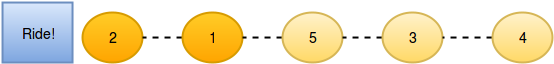

# New Year Chaos

It is New Year's Day and people are in line for the Wonderland rollercoaster ride. Each person wears a sticker indicating thier inital position in the queue from __1__ to _n_. Any person can bribe the person directly in front of them to swap postitons, but they still wear their original sticker. One person can bribe at most two others. Determine the minimum number of bribes that took place to get to a given queue order. Print the number of bribes, or, if anyone has bribed more than two people, print ```Too chaotic```

__Example__

_q_ = [1,2,3,5,4,6,7,8]

If person 5 bribes person 4, the queue will look like this: 1,2,3,5,4,6,7,8. Only 1 bribe is required. Print ```1```.

_q_ = [4,1,2,3]

Person 4 had to bribe 3 people to get to the current position. Print ```Too chaotic```

__Function Description__

Complete the function minimumBribes in the editor below.

minimumBribes has the following parameter(s):

- int q[n]: the positions of the people after all bribes

__Returns__

- No value is returned. Print the minimum number of bribes necessary or Too chaotic if someone has bribed more than 2 people.

__Input Format__

The first line contains an integer _t_, the number of test cases.

Each of the next _t_ pairs of lines are as follows:

- The first line contains an integer _t_, the number of people in the queue.

- The second line has _n_ space-separated integers secribing the final state of the queue.

__Constraints__

- 1 <= _t_ <= 10

- 1 <= _n_ <= 10<sup>5</sup>

__Subtasks__

For __60%__ score 1 <= _n_ <= 10<sup>3</sup>

For __100%__ score 1 <= _n_ <= 10<sup>5</sup>

__Sample Input__

```
STDIN       Function
-----       --------
2           t = 2
5           n = 5
2 1 5 3 4   q = [2, 1, 5, 3, 4]
5           n = 5
2 5 1 3 4   q = [2, 5, 1, 3, 4]
```

__Sample Output__

```
3
Too chaotic
```

__Explanation__

__Test Case 1__

The initial state:


After person __5__ moves one position ahead by bribing person __4__:


Now person __5__ moves another position ahead by bribing person __3__:


And person __3__ moves one position ahead by bribing person __1__:



So the final state is __2__, __1__, __5__, __3__, __4__ after three bribing operations.

__Test Case 2__

No person can bribe more than two people, yet it appears person 5 has done so. It is not possible to achieve the input state.

__Solution__

```java
public class Solution {

    static void minimumBribes(int[] q) {
        int bribes = 0;
        int max = q.length;

        for (int i = q.length - 1; i >= 0; i--) {
            if (q[i] > i + 3) {
                System.out.println("Too chaotic");
                return;
            } else if (q[i] == max && max - i == 2) {
                bribes++;
                q[i] = q[i + 1];
                q[i + 1] = max;
                max--;
                i = max;
            } else if (q[i] == max && max - i == 3) {
                bribes += 2;
                q[i] = q[i + 1];
                q[i + 1] = q[i + 2];
                q[i + 2] = max;
                max--;
                i = max;
            } else if (q[i] == max) {
                max--;
            }
        }

        System.out.println(bribes);
    }

}
```
